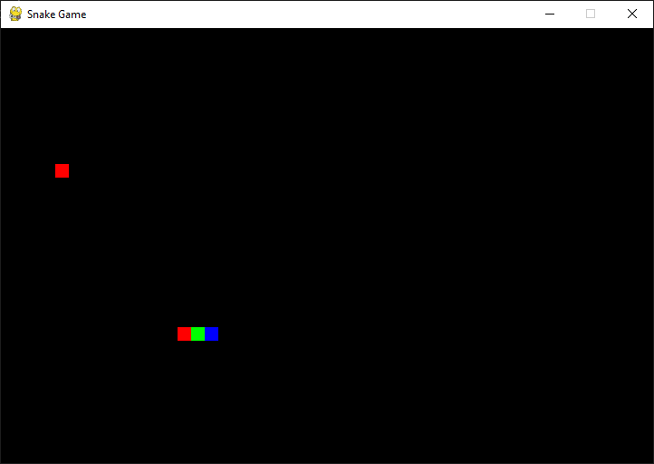
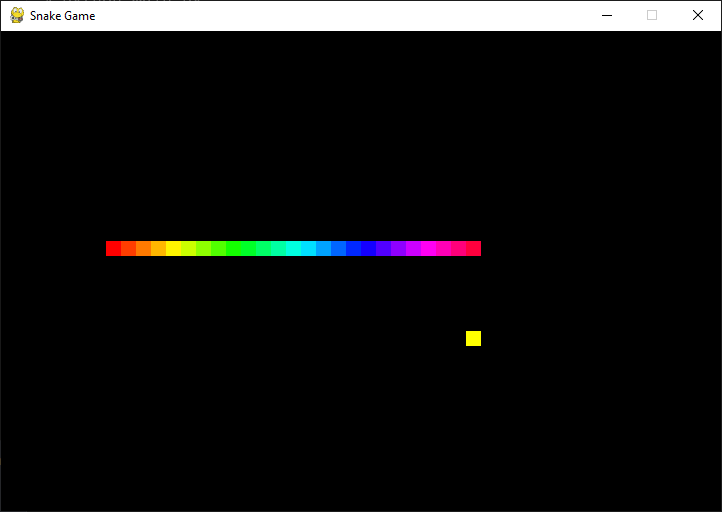
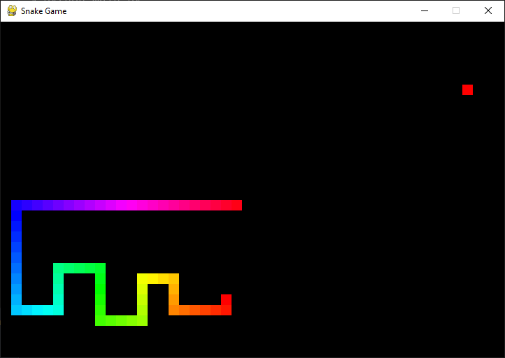

<h1 align="center">
Jogo da Cobrinha com Pygame
</h1>

<div align="center">
  
</div>
<div align="center">
  
</div>
<div align="center">
  
</div>

Uma simples versão do Jogo da Cobrinha feita com Python usando a biblioteca de jogo chamada [Pygame](https://www.pygame.org/news)

## 🚀 Tecnologias
 - Python
 - Pygame

## ⚙ Funcionalidades diferentes
 - Cobrinha tem uma 'cor de arco-íris', que na verdade é mais perceptível quanto maior vai ficando
 - Tem 5% de chance de aparecer uma 'frutinha especial' que aumenta 4 no corpo da cobrinha
 - Segurando a tecla <kbd>espaço</kbd>, a cobrinha receberá boost e irá perdendo parte de corpo com o uso (kkkk não muito útil aqui, mas é legal)

## 🛠 Instalação
 1. Clone o repositório
 ```
 git clone https://github.com/SadS4ndWiCh/snakegame-pygame.git
 ```
 2. Entre na pasta
 ```
 cd snakegame-pygame
 ```
 3. Instale as dependências necessárias
 ```
 pip install -r requirements.txt
 ```
 4. Por fim, inicialize o jogo
 ```
 python main.py
 ```